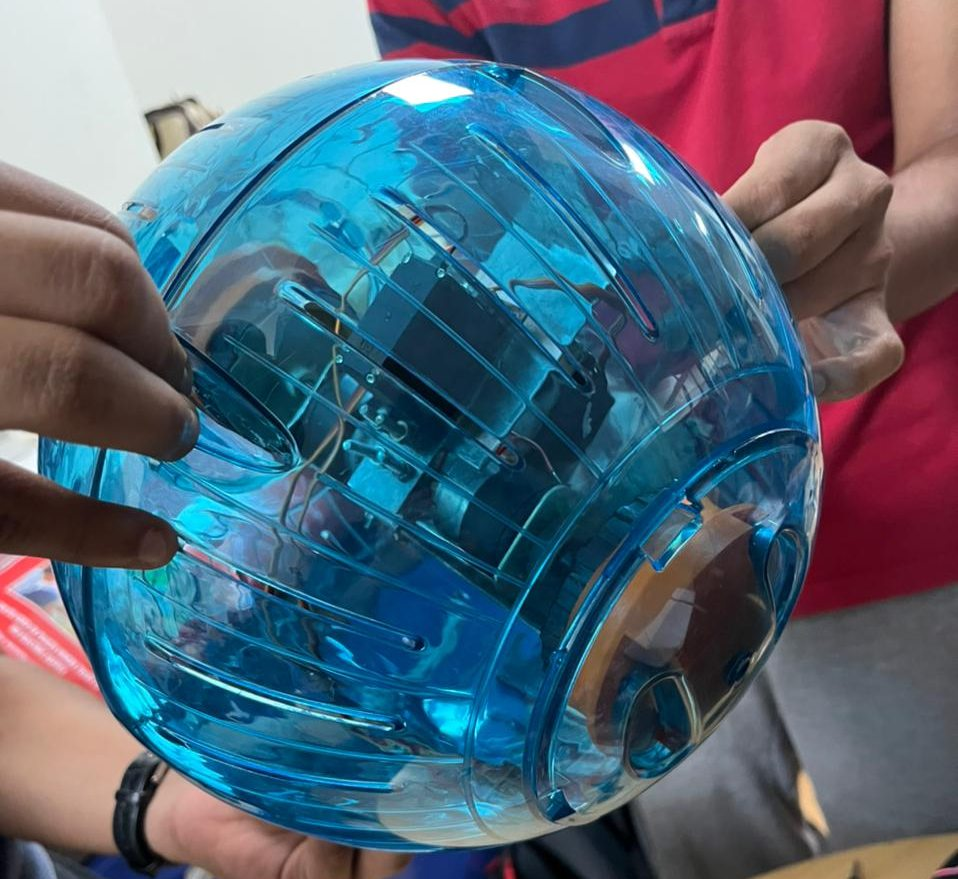
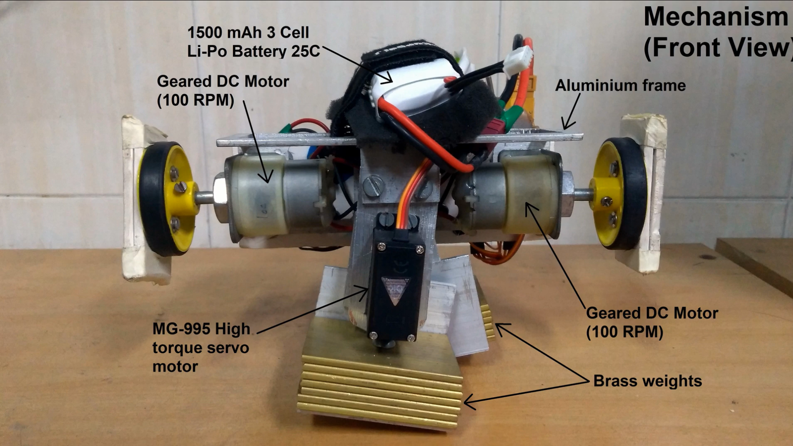

# Strikebot
Strikebot is a microcontroller based spherical ground robot

The robot is controlled by two coupled DC motors for linear motion, and has a servo-driven internal pendulum for directional motion by shifting the center of gravity.

_Sample mechanism: [Source](https://www.youtube.com/watch?v=GB-F9yLyRm8)_

> A closed loop active damping mechanism is implemented to reduce wobbling during motion. Orientation feedback for control is obtained from the onboard IMU (MPU 6050)

> The couplers for attaching to the spherical shell are custom designed and 3D-printed in house.

This project was built as a display project for [Quark](https://www.linkedin.com/company/quark-bits-pilani-goa/?originalSubdomain=in) 2022, the annual technical fest of BITS Goa. It is controllable via bluetooth, and can move in multiple open loop trajectories, with active damping for reduced oscillations.

### Arduino Dependencies:

1. [Dabble](https://github.com/STEMpedia/Dabble) for bluetooth control
2. [Adafruit MPU 6050](https://github.com/adafruit/Adafruit_MPU6050) for IMU interfacing
3. [Cytron Motor Driver Library](https://github.com/CytronTechnologies/CytronMotorDriver) for interfacing with motor driver

Inspired by a similar [project](https://www.youtube.com/watch?v=GB-F9yLyRm8) by Dr. Aseem Borkar and Mr. Kumar Khot.

> Date of completion: March - April 2022